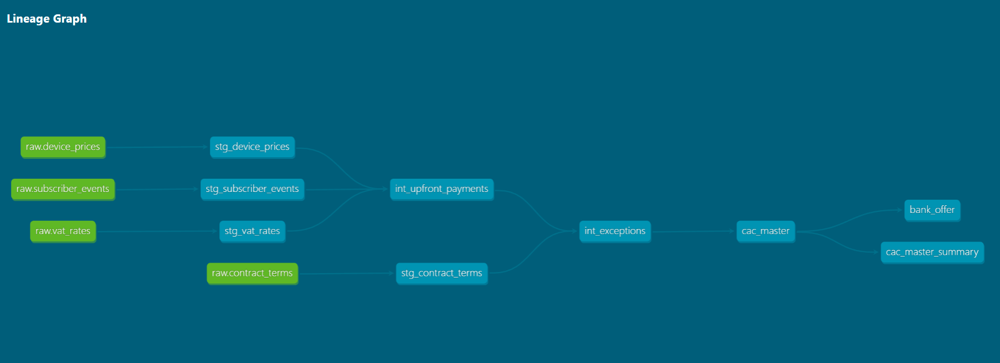

\# CAC Master - dbt + BigQuery Pipeline


\## What is this project?


This project recreates the Customer Acquisition Cost (CAC) Master pipeline using dbt and BigQuery. It mirrors a real-world financial data pipeline built for a telecoms company to track subsidised handset contracts.


\## Business Problem


When a customer buys a handset on a contract, they pay less than the full retail price upfront. The company absorbs the gap — this is the subsidy. 


For example — a €1000 handset, customer pays €400 upfront. The company is owed €600 back over 24 months at €25 per month.


This pipeline:

\- Calculates the subsidy on each contract

\- Validates data quality and flags exceptions

\- Calculates monthly recovery amounts

\- Identifies open and closed contracts


\## Tech Stack


\- \*\*dbt Core\*\* — data transformation and testing

\- \*\*Google BigQuery\*\* — cloud data warehouse

\- \*\*SQL\*\* — business logic and transformations

\- \*\*Git/GitHub\*\* — version control


\## Project Structure

cac\_master/

├── models/

│   ├── staging/          # Raw data cleaned and filtered

│   ├── intermediate/     # Business logic and calculations

│   └── marts/            # Final output tables

├── tests/                # Data quality tests

└── dbt\_project.yml       # Project configuration


\## Pipeline Architecture

Raw Data (BigQuery)

↓

Staging Layer — clean and filter raw data

↓

Intermediate Layer — apply business logic

↓

Marts Layer — final CAC Master output


\## Models


\### Staging

\- `stg\_subscriber\_events` — filters FTC and UPG events, excludes prepaid customers, fixes data types

\- `stg\_device\_prices` — device pricing reference data

\- `stg\_vat\_rates` — VAT rate reference data

\- `stg\_contract\_terms` — contract term reference data


\### Intermediate

\- `int\_upfront\_payments` — calculates actual upfront payment by sales channel (Consumer, SME, SFDC/Mass)

\- `int\_exceptions` — flags data quality exceptions (invalid handset, missing device cost, invalid upfront payment, invalid contract term)


\### Marts

\- `cac\_master` — final output with subsidy calculation, monthly recovery amount, and contract status


\## Key Business Logic


\### Upfront Payment by Channel

\- \*\*Consumer (CON)\*\* — uses actual equipment charge from order system

\- \*\*SFDC/Mass\*\* — uses selling price from business transaction table

\- \*\*Default\*\* — uses RRP price stripped of VAT


\### Exception Handling

| Exception | Condition | Status |

|-----------|-----------|--------|

| Invalid Handset | No oracle product code | Closed |

| Device Cost | Device price is null | Closed |

| Upfront Payment | Upfront payment null or negative | Closed |

| Contract Term | Term not 12, 18, or 24 months | Closed |


\### CAC Calculations

\- `init\_debt\_value` = Device Cost - Upfront Payment

\- `monthly\_cac` = init\_debt\_value / Contract Term

\- `sch\_status` = Open (no exception) or Closed (exception exists)


\## Data Quality Tests

\- `subscriber\_id` — not null

\- `customer\_id` — not null

\- `sch\_status` — not null, accepted values: Open, Closed

\- `init\_debt\_value` — not null

\- `hrs\_exception` — accepted values: Invalid Handset, Device Cost, Upfront Payment, Contract Term


\## How to Run


\### Prerequisites

\- Python 3.8+

\- dbt Core with BigQuery adapter

\- Google Cloud Platform account

\- BigQuery dataset with raw source tables


\### Setup

```bash

\# Create virtual environment

python -m venv dbt\_env

dbt\_env\\Scripts\\activate


\# Install dbt

pip install dbt-bigquery


\# Initialise project

dbt init cac\_master


\# Run all models

dbt run


\# Run tests

dbt test


\# Generate documentation

dbt docs generate

dbt docs serve

```
### Pipeline Lineage




\## Author

Janvi Rajani

\- LinkedIn: https://www.linkedin.com/in/janvi-rajani-b2ba0aa7/

\- GitHub: https://github.com/JanviRajani25

